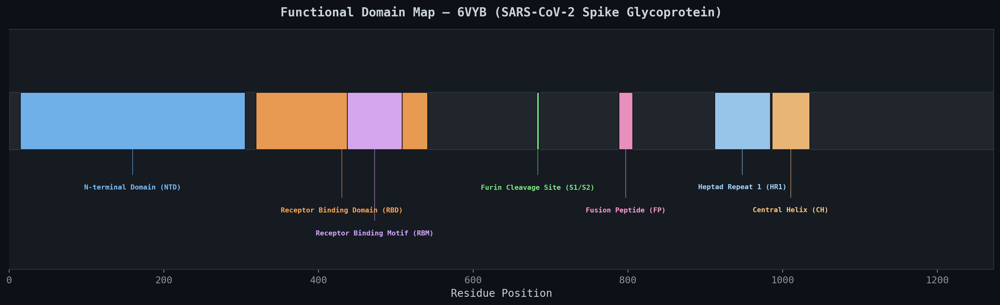
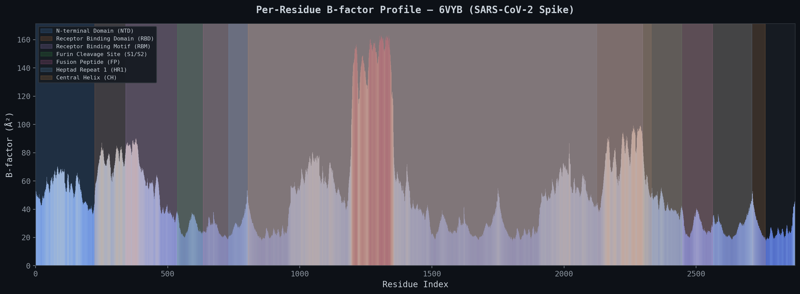
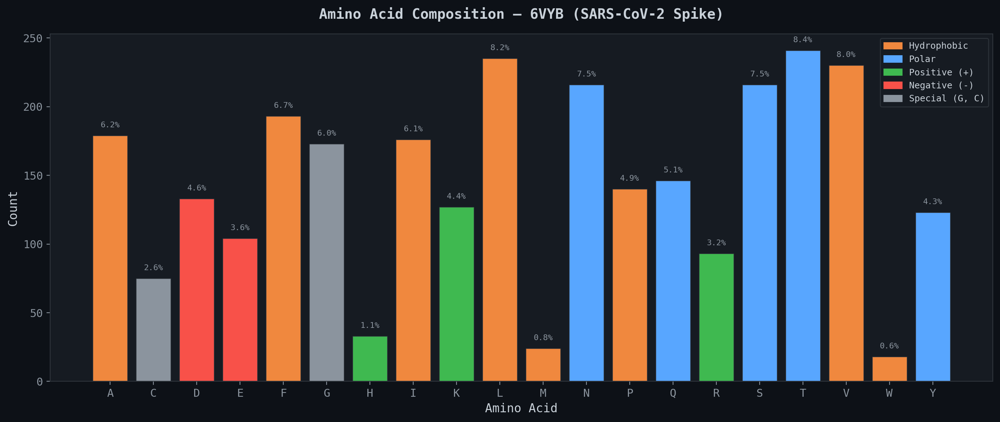
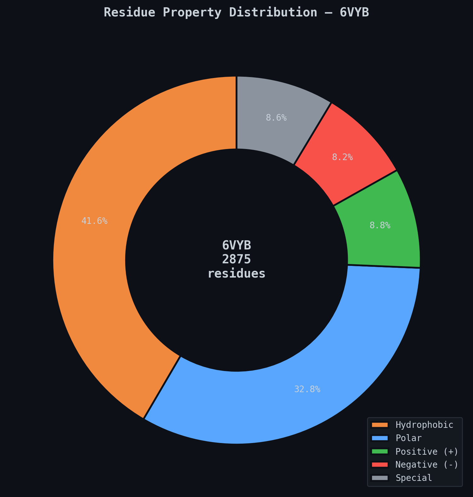
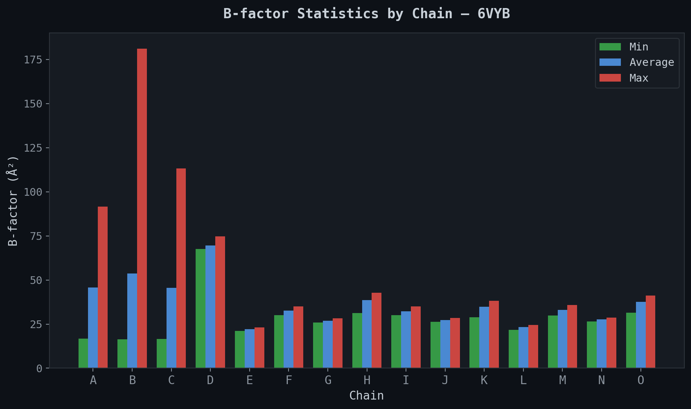
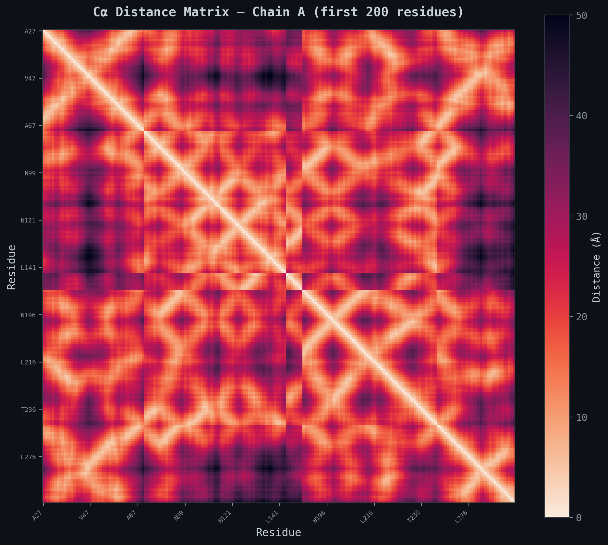

# Protein Structure Visualization Tool

A comprehensive Python toolkit for fetching, analyzing, and visualizing disease-relevant protein structures from the [RCSB Protein Data Bank](https://www.rcsb.org/).

**Target Protein:** SARS-CoV-2 Spike Glycoprotein — [PDB 6VYB](https://www.rcsb.org/structure/6VYB) (open state)

## About the Protein

The **SARS-CoV-2 Spike Glycoprotein (S protein)** is a trimeric class I fusion protein on the surface of the SARS-CoV-2 virus responsible for the COVID-19 pandemic. It mediates viral entry into human cells by binding to the **ACE2 receptor** on host cells.

| Property | Value |
|---|---|
| PDB ID | [6VYB](https://www.rcsb.org/structure/6VYB) |
| Structure | Spike ectodomain (open state) |
| Method | Cryo-EM (3.2 Å resolution) |
| Organism | Severe acute respiratory syndrome coronavirus 2 |
| Molecular Weight | 437.44 kDa |
| Chains | 3 protomers (A, B, C) + glycan chains |
| Atoms | 22,365 deposited |
| Residues | 3,843 (1,281 per protomer) |
| Disulfide Bonds | 35 |
| Citation | Walls et al., *Cell* 181:281 (2020) — [DOI](https://doi.org/10.1016/j.cell.2020.02.058) |

### Key Functional Domains

```
Position 1                                                         1273
|────────────────────────────────────────────────────────────────────|
|  NTD (14-305)  | RBD (319-541) |        |FCS|  FP  | HR1  | CH  |
|                | RBM (437-508) |        |682|      |      |     |
```

- **NTD (N-terminal Domain):** Host cell attachment and immune evasion
- **RBD (Receptor Binding Domain):** Directly contacts the ACE2 receptor; main target for neutralizing antibodies and vaccine design
- **RBM (Receptor Binding Motif):** The specific contact interface with ACE2; contains critical mutation sites (e.g., N501Y, E484K)
- **Furin Cleavage Site (S1/S2):** RRAR motif at position 682-685, unique to SARS-CoV-2 and absent in SARS-CoV — enhances cell entry efficiency
- **Fusion Peptide:** Inserts into the host cell membrane to initiate membrane fusion
- **HR1 / Central Helix:** Structural elements critical for the conformational change that drives virus-cell fusion

## Features

### Static Visualizations (matplotlib)
- **B-factor Profile** — Per-residue thermal displacement with functional region annotations
- **Amino Acid Composition** — Bar chart color-coded by biochemical property
- **Residue Property Distribution** — Donut chart (hydrophobic, polar, charged, special)
- **Cα Distance Matrix (Contact Map)** — Reveals domain boundaries and tertiary contacts
- **Chain B-factor Comparison** — Per-chain flexibility statistics
- **Functional Domain Map** — Linear map of annotated regions

### Interactive 3D Viewers (py3Dmol → HTML)
- **Cartoon View** — Secondary structure colored by spectrum (rainbow N→C)
- **Surface View** — Solvent-accessible surface with cartoon backbone
- **Region Highlights** — Functional domains (RBD, NTD, FP, etc.) in distinct colors
- **B-factor Coloring** — Blue (rigid) to red (flexible) thermal displacement

### Structural Analysis (BioPython)
- Per-chain residue, atom, and B-factor statistics
- Amino acid composition and biochemical property classification
- Cα-Cα distance matrix computation
- Annotated functional regions for known disease proteins
- Full analysis export to JSON

## Installation

```bash
git clone https://github.com/desenyon/protein-viz.git
cd protein-viz
pip install -r requirements.txt
```

### Dependencies

| Package | Purpose |
|---|---|
| `biopython` | PDB parsing, structure analysis |
| `py3Dmol` | Interactive 3D molecular visualization |
| `matplotlib` | Static 2D plots and charts |
| `seaborn` | Enhanced heatmap coloring |
| `numpy` | Numerical computation |
| `requests` | RCSB PDB API and file downloads |
| `Pillow` | Image handling |

## Usage

### Full Pipeline (Default: SARS-CoV-2 Spike)

```bash
python main.py
```

### CLI Options

```bash
python main.py --pdb 6VYB           # Analyze SARS-CoV-2 Spike (default)
python main.py --pdb 6VXX           # Closed-state spike for comparison
python main.py --pdb 7DWZ --chain B # Different protein, different chain
python main.py --info-only           # Print metadata without generating plots
python main.py --no-3d               # Skip interactive HTML generation
```

### As a Python Library

```python
from src.fetcher import fetch_pdb_file, fetch_metadata, parse_structure
from src.analyzer import get_chain_stats, get_residue_composition, summarize_structure
from src.visualizer import plot_bfactor_profile, plot_composition
from src.viewer_3d import create_all_views

# Fetch and parse
pdb_file = fetch_pdb_file("6VYB")
structure = parse_structure(pdb_file, "6VYB")

# Analyze
summary = summarize_structure(structure, "6VYB")
print(f"Total residues: {summary['total_residues']}")
print(f"Total atoms: {summary['total_atoms']}")

# Visualize
metadata = fetch_metadata("6VYB")
from src.analyzer import get_residue_bfactors, identify_key_regions
bfactors = get_residue_bfactors(structure)
regions = identify_key_regions(structure, "6VYB")
plot_bfactor_profile(bfactors, "6VYB", regions)

# Interactive 3D
create_all_views("6VYB")
```

## Output Files

After running the pipeline, the `output/` directory will contain:

```
output/
├── 6VYB_analysis.json      # Full structural analysis (JSON)
├── bfactor_profile.png     # B-factor line plot with region annotations
├── aa_composition.png      # Amino acid bar chart
├── property_dist.png       # Residue property donut chart
├── contact_map.png         # Cα distance matrix heatmap
├── chain_bfactors.png      # Per-chain B-factor comparison
├── domain_map.png          # Linear functional domain map
├── 6VYB_cartoon.html       # 3D cartoon view (open in browser)
├── 6VYB_surface.html       # 3D surface view
├── 6VYB_regions.html       # 3D region highlight view
└── 6VYB_bfactor3d.html     # 3D B-factor colored view
```

Open any `.html` file in a browser for interactive 3D visualization (drag to rotate, scroll to zoom).

## Project Structure

```
protein-viz/
├── main.py                 # CLI entry point
├── requirements.txt        # Python dependencies
├── README.md
├── .gitignore
├── src/
│   ├── __init__.py         # Package metadata
│   ├── fetcher.py          # RCSB PDB download & API queries
│   ├── analyzer.py         # Structural analysis (BioPython)
│   ├── visualizer.py       # Static matplotlib visualizations
│   └── viewer_3d.py        # Interactive 3D HTML viewers (py3Dmol)
├── tests/
│   └── test_pipeline.py    # Unit tests (10 tests)
├── data/                   # Downloaded PDB files (gitignored)
└── output/                 # Generated visualizations (gitignored)
```

## Tests

```bash
python -m unittest tests.test_pipeline -v
```

Runs 10 tests covering:
- PDB file download and caching
- RCSB API metadata fetching
- BioPython structure parsing
- Chain statistics computation
- B-factor extraction
- Amino acid composition analysis
- Biochemical property distribution
- Cα distance matrix computation
- Functional region annotation
- Full structural summary

## Scientific Background

### B-factors (Temperature Factors)

B-factors quantify the displacement of atoms from their mean position in the crystal/cryo-EM structure. Higher B-factors indicate greater atomic mobility or structural disorder. In the spike protein:
- The **RBD** shows elevated B-factors in the open state (6VYB) because it is extended and more flexible
- The **S2 stalk region** (HR1, CH) tends to be more rigid, as it maintains the trimeric architecture

### Contact Maps

The Cα distance matrix reveals the spatial proximity of residue pairs. Off-diagonal clusters of close contacts indicate:
- **Secondary structure** (helices show characteristic diagonal bands)
- **Tertiary contacts** (long-range contacts between distant sequence positions)
- **Domain boundaries** (block-diagonal patterns)

### Why This Protein Matters

PDB 6VYB was among the first cryo-EM structures of the SARS-CoV-2 spike protein, published in *Cell* in February 2020 — just weeks after the virus genome was sequenced. This structure was critical for:
1. Understanding how the virus binds human cells via ACE2
2. Designing mRNA vaccines (Pfizer, Moderna) that encode a stabilized spike
3. Developing monoclonal antibody therapies targeting the RBD
4. Tracking how variants (Alpha, Delta, Omicron) mutate the spike

---

## Example Analysis Report: SARS-CoV-2 Spike Glycoprotein (6VYB)

Below is a complete walkthrough of the pipeline output for **PDB 6VYB** — the open-state cryo-EM structure of the SARS-CoV-2 spike ectodomain at 3.2 Å resolution. This is what you get when you run `python main.py`.

### Structure Overview

| Metric | Value |
|---|---|
| Total modeled residues | 2,875 (of 3,843 deposited across 3 protomers) |
| Total atoms | 22,365 |
| Protein chains | A, B, C (protomers) + D–O (glycan/NAG chains) |
| Disulfide bonds | 35 |
| Organism | Severe acute respiratory syndrome coronavirus 2 |
| Unmodeled residues | 968 (disordered loops not resolved at 3.2 Å) |

The trimeric spike has three nearly identical protomers (chains A, B, C), each ~966 resolved residues out of 1,281 in the full sequence. Chains D–O are N-acetylglucosamine (NAG) glycan chains attached to the protein surface — these sugar modifications are critical for immune evasion and protein folding.

---

### Functional Domain Map



This linear map shows the major functional domains along the 1,273-residue spike monomer sequence. Key takeaways:

- **S1 subunit** (residues 14–685) handles receptor binding. It contains the NTD and RBD, which are the primary targets for neutralizing antibodies.
- **S2 subunit** (residues 686–1273) drives membrane fusion. It contains the fusion peptide, HR1, and central helix.
- The **furin cleavage site** (RRAR, positions 682–685) sits at the S1/S2 boundary. This polybasic cleavage motif is unique to SARS-CoV-2 — SARS-CoV lacks it entirely — and is processed by host furin proteases during viral biogenesis, priming the spike for cell entry.
- The **RBM** (437–508) is nested within the larger RBD (319–541). This ~70-residue motif is the actual contact surface that binds ACE2, and it is where most concerning mutations appear in variants of concern (N501Y in Alpha, E484K in Beta, L452R in Delta).

---

### Per-Residue B-factor Profile



**What B-factors tell us:** B-factors (also called temperature factors or Debye-Waller factors) measure the mean-square displacement of each atom from its average position. In a cryo-EM structure like 6VYB, they reflect local flexibility and conformational heterogeneity rather than literal thermal motion.

**Observations from 6VYB:**

1. **Sharp B-factor spike around residue index ~1100–1300** (corresponding to the boundary between protomers in the plotted data): These peaks reaching >150 Ų correspond to the region near the S1/S2 cleavage site and flexible inter-domain linkers. The furin cleavage site is intrinsically disordered, consistent with it being accessible to protease cleavage.

2. **RBD region (highlighted in orange)** shows moderately elevated B-factors (~50–80 Ų). In the open state (6VYB), one RBD is in the "up" conformation, exposing the ACE2 binding surface. This upward displacement makes it more mobile than the two RBDs that remain in the "down" position.

3. **NTD region (blue)** shows variable flexibility. The NTD supersite — a target for a distinct class of antibodies — has loops with high B-factors, indicating conformational plasticity that may facilitate immune evasion.

4. **S2 stalk (HR1, CH)** has consistently low B-factors (~20–30 Ų), reflecting the rigid coiled-coil core that holds the trimer together. This rigidity is functionally essential: the stalk must maintain structural integrity until the spike undergoes the dramatic conformational rearrangement that drives membrane fusion.

---

### Amino Acid Composition



This chart shows the frequency of each of the 20 standard amino acids across all resolved residues, color-coded by biochemical property:

| Category | Color | Residues | Percentage |
|---|---|---|---|
| Hydrophobic | Orange | A, I, L, M, F, W, V, P | 41.6% |
| Polar | Blue | S, T, N, Q, Y | 32.8% |
| Positive (+) | Green | R, H, K | 8.8% |
| Negative (-) | Red | D, E | 8.2% |
| Special | Gray | G, C | 8.6% |

**Notable features:**

- **Threonine (T) is the most abundant residue at 8.4%**, followed closely by leucine (L, 8.2%) and valine (V, 8.0%). The high Thr content is characteristic of viral glycoproteins — Thr and Ser residues serve as O-linked glycosylation sites.
- **Asparagine (N) at 7.5%** is elevated relative to the human proteome average (~4%). This reflects the high density of N-linked glycosylation sites (N-X-S/T sequons) on the spike, which decorate the protein surface with glycan shields.
- **Cysteine (C) at 2.6%** contributes to 35 disulfide bonds across the trimer, stabilizing the complex folded domains.
- **Tryptophan (W) is the rarest at 0.6%**, consistent with its general scarcity in most proteins due to its metabolic cost.
- The high proportion of **hydrophobic residues (41.6%)** reflects the large buried interfaces between the three protomers and between the S1 and S2 subunits.

---

### Residue Property Distribution



This donut chart provides a simplified view of the biochemical character of the spike protein:

- The **~42% hydrophobic content** is typical for a large, multi-domain transmembrane protein. These residues pack the hydrophobic cores of each domain and line the inter-protomer interfaces.
- The **~33% polar content** is on the high side, reflecting the spike's extensive solvent-exposed surface — it protrudes ~160 Å from the viral membrane and must remain soluble in the extracellular environment.
- The **near-equal split between positive (8.8%) and negative (8.2%) charged residues** gives the spike a near-neutral net charge at physiological pH, which is typical for viral surface proteins that must avoid nonspecific electrostatic interactions with host glycocalyx.

---

### B-factor Statistics by Chain



This chart compares the minimum, average, and maximum B-factors across all 15 chains in the PDB entry.

| Chain | Residues | Avg B-factor | Max B-factor | Role |
|---|---|---|---|---|
| A | 966 | 45.7 Ų | 91.5 Ų | Protomer 1 |
| B | 949 | 53.6 Ų | 181.1 Ų | Protomer 2 ("up" RBD) |
| C | 960 | 45.6 Ų | 113.3 Ų | Protomer 3 |
| D–O | 0 aa each | 22–70 Ų | varies | NAG glycan chains |

**Key insight:** Chain B has a markedly higher average B-factor (53.6 vs ~45.7 for A and C) and the highest maximum B-factor in the entire structure (181.1 Ų). This is the protomer whose RBD is in the **"up" (open) conformation** — extended away from the trimer axis to expose the ACE2 binding surface. The elevated flexibility is a direct structural consequence of this conformational state. Chains A and C, with their RBDs in the "down" position, are more constrained by inter-protomer contacts and are therefore more rigid.

Chains D through O are the N-acetylglucosamine (NAG) glycan chains. They have zero protein residues but contain 28 atoms each (sugar ring atoms). Their B-factors are generally low (22–38 Ų), except for chain D (69.6 Ų), which is likely a glycan on the more flexible chain B protomer.

---

### Cα Distance Matrix (Contact Map)



**What this shows:** Each pixel represents the Euclidean distance between two Cα atoms (the central carbon of each amino acid backbone). This is computed for the first 200 residues of chain A, covering most of the NTD.

**How to read it:**
- The **diagonal** is always 0 Å (each residue is 0 distance from itself).
- **Light/warm colors** = close in 3D space (<10 Å). These are residue pairs that are in physical contact.
- **Dark/cool colors** = far apart (>30 Å).

**Structural features visible:**

1. **Block-diagonal patterns** (distinct bright squares along the diagonal): These correspond to compact sub-domains within the NTD. Each block represents a group of residues that are close to each other in 3D space but separated from other groups.

2. **Off-diagonal bright spots**: These are long-range contacts — residues far apart in sequence but close in 3D space. In the NTD, these arise from the beta-sandwich fold where antiparallel beta-strands bring distant sequence positions into close proximity.

3. **Characteristic banding near the diagonal**: Regular secondary structure elements create predictable patterns. Alpha-helices produce a thicker bright band along the diagonal (consecutive residues ~5.4 Å apart in helical pitch), while beta-sheets produce thinner bands with off-diagonal contacts from paired strands.

4. **Visible domain boundary around residue ~140**: There is a noticeable transition in the contact pattern, corresponding to the boundary between two structural lobes of the NTD. This kind of domain boundary identification is one of the primary uses of contact maps in structural biology.

---

### Interactive 3D Views

The pipeline also generates four interactive HTML files that can be opened in any browser:

| File | Description |
|---|---|
| `6VYB_cartoon.html` | Secondary structure (helices, sheets, loops) colored N→C terminus in rainbow spectrum |
| `6VYB_surface.html` | Solvent-accessible molecular surface, revealing the overall shape and the glycan-shielded topology |
| `6VYB_regions.html` | Functional domains highlighted: RBD (orange), NTD (blue), Fusion Peptide (green), etc. on a gray backbone |
| `6VYB_bfactor3d.html` | Colored by B-factor: blue = rigid core, red = flexible loops and the "up" RBD |

Each viewer supports rotation (drag), zoom (scroll), and translation (right-click drag).

---

### Summary of Findings

This analysis of PDB 6VYB reveals several structural features that are directly relevant to SARS-CoV-2 biology and therapeutic targeting:

1. **Asymmetric flexibility in the open state.** The protomer with the "up" RBD (chain B) is significantly more flexible than the other two, with B-factors reaching 181 Ų. This conformational heterogeneity is what allows the spike to transition between closed (all RBDs down, immune-evasive) and open (one or more RBDs up, ACE2-binding-competent) states.

2. **The RBD is a structurally distinct, semi-autonomous domain.** The contact map and B-factor analysis both show that the RBD (319–541) behaves as a hinge-mounted module that can flip between up and down positions. This modularity is why the RBD is such an effective vaccine immunogen — it can fold independently and present its epitopes correctly.

3. **Glycan shielding is extensive.** With 12 glycan chains (D–O) and high asparagine content (7.5%), the spike surface is heavily decorated with sugars that mask protein epitopes from antibodies. The NTD and portions of the S2 stalk are particularly shielded.

4. **The S2 core is rigid and conserved.** Low B-factors in HR1 and the central helix suggest these regions are structurally constrained and likely less tolerant of mutations — which is why S2-targeting antibodies tend to be more broadly cross-reactive across coronavirus strains.

5. **The furin cleavage site is intrinsically disordered.** The high B-factors near position 682–685 and the 968 unmodeled residues (many in this region) confirm that the RRAR motif is a flexible, solvent-exposed loop — exactly the properties needed for efficient protease recognition and cleavage.

---

## Data Source

All structural data is fetched from the [RCSB Protein Data Bank](https://www.rcsb.org/) (RCSB PDB), the primary archive for experimentally determined 3D structures of biological macromolecules.

## License

MIT License

## Author

Naitik Gupta
